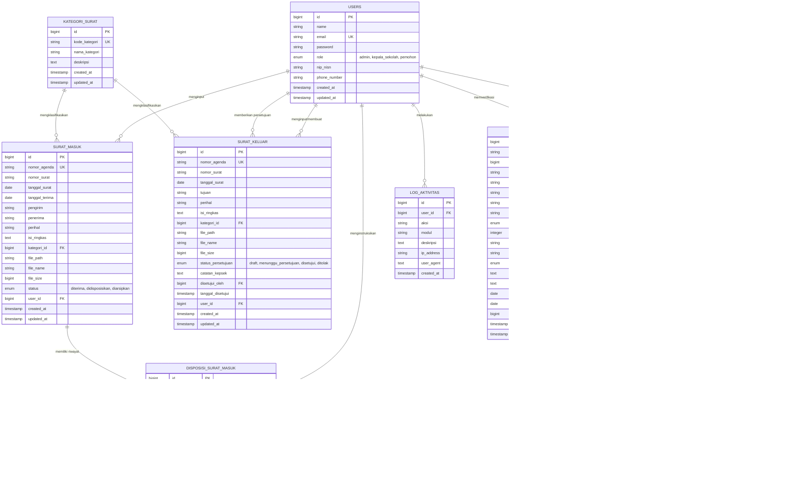

# 02. PERANCANGAN DATABASE DAN ERD
**Sistem Informasi Pengelolaan Arsip SMKN 1 Subang**  
*Basis Data: MySQL 8.x (Relational DBMS)*

---

## 1. Diagram Hubungan Entitas (Entity-Relationship Diagram / ERD)

Berikut adalah diagram relasi basis data menggunakan notasi Mermaid yang mencakup seluruh kebutuhan fungsional surat masuk, surat keluar, disposisi, legalisir, dan manajemen pengguna:

---

## 2. Rincian Kamus Data (Data Dictionary)

### 2.1. Tabel `users`
Menyimpan identitas seluruh pemangku kepentingan sistem (Petugas TU, Kepala Sekolah, dan Pemohon Legalisir).
- `id`: BIGINT, Auto Increment, Primary Key.
- `name`: VARCHAR(150), Not Null.
- `email`: VARCHAR(191), Unique, Not Null.
- `password`: VARCHAR(255), Not Null (Hash Bcrypt).
- `role`: ENUM('admin', 'kepala_sekolah', 'pemohon'), Default 'pemohon'.
- `nip_nisn`: VARCHAR(50), Nullable (NIP untuk petugas/kepsek, NISN untuk pemohon).
- `phone_number`: VARCHAR(25), Nullable (Untuk notifikasi WhatsApp/kontak).
- `avatar`: VARCHAR(255), Nullable.
- `remember_token`: VARCHAR(100), Nullable.
- `created_at`, `updated_at`: TIMESTAMP.

### 2.2. Tabel `kategori_surat`
Menyimpan referensi klasifikasi surat (misal: Kepegawaian, Kesiswaan, Kurikulum, Sarana Prasarana, Hubungan Industri/Humas).
- `id`: BIGINT, Auto Increment, Primary Key.
- `kode_kategori`: VARCHAR(20), Unique, Not Null (contoh: `421.5/KUR`).
- `nama_kategori`: VARCHAR(100), Not Null.
- `deskripsi`: TEXT, Nullable.
- `created_at`, `updated_at`: TIMESTAMP.

### 2.3. Tabel `surat_masuk`
Menyimpan seluruh metadata surat yang diterima dari pihak luar instansi.
- `id`: BIGINT, Auto Increment, Primary Key.
- `nomor_agenda`: VARCHAR(50), Unique, Not Null (Penomoran buku agenda internal).
- `nomor_surat`: VARCHAR(100), Not Null (Nomor resmi dari instansi pengirim).
- `tanggal_surat`: DATE, Not Null.
- `tanggal_terima`: DATE, Not Null.
- `pengirim`: VARCHAR(255), Not Null (Instansi / Lembaga / Perorangan pengirim).
- `penerima`: VARCHAR(255), Default 'Kepala SMKN 1 Subang'.
- `perihal`: VARCHAR(255), Not Null (Topik utama surat - ditargetkan oleh algoritma KMP).
- `isi_ringkas`: TEXT, Nullable (Resume pokok isi surat).
- `kategori_id`: BIGINT, Foreign Key ke `kategori_surat.id`.
- `file_path`: VARCHAR(255), Not Null (Path file PDF scan dokumen di storage).
- `file_name`: VARCHAR(255), Not Null (Nama asli berkas saat diunggah).
- `file_size`: BIGINT, Not Null (Ukuran file dalam bytes).
- `status`: ENUM('diterima', 'didisposisikan', 'diarsipkan'), Default 'diterima'.
- `user_id`: BIGINT, Foreign Key ke `users.id` (Petugas pencatat).
- `created_at`, `updated_at`: TIMESTAMP.

### 2.4. Tabel `surat_keluar`
Menyimpan seluruh arsip surat dinas yang diterbitkan oleh SMKN 1 Subang.
- `id`: BIGINT, Auto Increment, Primary Key.
- `nomor_agenda`: VARCHAR(50), Unique, Not Null.
- `nomor_surat`: VARCHAR(100), Not Null (Nomor klasifikasi resmi surat keluar).
- `tanggal_surat`: DATE, Not Null.
- `tujuan`: VARCHAR(255), Not Null (Instansi / Penerima tujuan).
- `perihal`: VARCHAR(255), Not Null (Topik utama surat keluar).
- `isi_ringkas`: TEXT, Nullable.
- `kategori_id`: BIGINT, Foreign Key ke `kategori_surat.id`.
- `file_path`: VARCHAR(255), Not Null (File draf/final berkas surat keluar).
- `file_name`: VARCHAR(255), Not Null.
- `file_size`: BIGINT, Not Null.
- `status_persetujuan`: ENUM('draft', 'menunggu_persetujuan', 'disetujui', 'ditolak'), Default 'draft'.
- `catatan_kepsek`: TEXT, Nullable (Catatan revisi atau persetujuan pimpinan).
- `disetujui_oleh`: BIGINT, Nullable, Foreign Key ke `users.id` (Kepala Sekolah).
- `tanggal_disetujui`: TIMESTAMP, Nullable.
- `user_id`: BIGINT, Foreign Key ke `users.id` (Petugas pembuat).
- `created_at`, `updated_at`: TIMESTAMP.

### 2.5. Tabel `disposisi_surat_masuk`
Menampung lembar tindak lanjut instruksi dari Kepala Sekolah kepada unit kerja/guru terkait.
- `id`: BIGINT, Auto Increment, Primary Key.
- `surat_masuk_id`: BIGINT, Foreign Key ke `surat_masuk.id` (Cascade on delete).
- `diberikan_oleh`: BIGINT, Foreign Key ke `users.id` (Kepala Sekolah).
- `tujuan_disposisi`: VARCHAR(150), Not Null (cth: Waka Kurikulum, Pembina OSIS, Staf Keuangan).
- `instruksi`: TEXT, Not Null (cth: Tindak lanjuti, Hadiri, Pelajari & Laporkan).
- `catatan`: TEXT, Nullable.
- `batas_waktu`: DATE, Nullable.
- `status`: ENUM('menunggu', 'ditindaklanjuti', 'selesai'), Default 'menunggu'.
- `created_at`, `updated_at`: TIMESTAMP.

### 2.6. Tabel `pengajuan_legalisir`
Menyimpan seluruh data permohonan legalisir berkas ijazah/transkrip alumni secara online.
- `id`: BIGINT, Auto Increment, Primary Key.
- `nomor_pengajuan`: VARCHAR(50), Unique, Not Null (Format: `LEG-YYYYMM-XXXX`).
- `user_id`: BIGINT, Nullable, Foreign Key ke `users.id` (Akun pemohon terdaftar).
- `nama_pemohon`: VARCHAR(150), Not Null.
- `nisn`: VARCHAR(20), Not Null.
- `tahun_lulus`: YEAR, Not Null.
- `nomor_whatsapp`: VARCHAR(25), Not Null.
- `email`: VARCHAR(191), Not Null.
- `jenis_dokumen`: ENUM('ijazah', 'transkrip_nilai', 'rapor', 'sertifikat_keahlian'), Not Null.
- `jumlah_lembar`: INT, Not Null, Default 1.
- `keperluan`: VARCHAR(255), Not Null (cth: Melamar Pekerjaan, Daftar Kuliah, Bintara TNI/POLRI).
- `file_dokumen_path`: VARCHAR(255), Not Null (Scan ijazah asli yang diupload pemohon).
- `status`: ENUM('menunggu_verifikasi', 'diverifikasi', 'menunggu_approval_kepsek', 'disetujui_kepsek', 'sedang_diproses', 'siap_diambil', 'selesai', 'ditolak'), Default 'menunggu_verifikasi'.
- `catatan_petugas`: TEXT, Nullable (Alasan jika berkas kurang jelas atau ditolak).
- `catatan_kepsek`: TEXT, Nullable.
- `tanggal_siap_ambil`: DATE, Nullable.
- `tanggal_pengambilan`: DATE, Nullable.
- `petugas_id`: BIGINT, Nullable, Foreign Key ke `users.id`.
- `created_at`, `updated_at`: TIMESTAMP.

### 2.7. Tabel `riwayat_legalisir`
Log audit trail transisi status berkas legalisir untuk ditampilkan pada timeline pelacakan (*tracking*).
- `id`: BIGINT, Auto Increment, Primary Key.
- `pengajuan_legalisir_id`: BIGINT, Foreign Key ke `pengajuan_legalisir.id`.
- `status_sebelumnya`: VARCHAR(50), Nullable.
- `status_baru`: VARCHAR(50), Not Null.
- `diubah_oleh`: BIGINT, Foreign Key ke `users.id`.
- `catatan`: TEXT, Nullable.
- `created_at`: TIMESTAMP.

### 2.8. Tabel `log_aktivitas`
Mencatat seluruh aksi penting di dalam sistem demi akuntabilitas keamanan data arsip.
- `id`: BIGINT, Auto Increment, Primary Key.
- `user_id`: BIGINT, Nullable, Foreign Key ke `users.id`.
- `aksi`: VARCHAR(100), Not Null (cth: CREATE, UPDATE, DELETE, SEARCH_KMP, APPROVE).
- `modul`: VARCHAR(50), Not Null (cth: SURAT_MASUK, SURAT_KELUAR, LEGALISIR).
- `deskripsi`: TEXT, Not Null.
- `ip_address`: VARCHAR(45), Nullable.
- `user_agent`: TEXT, Nullable.
- `created_at`: TIMESTAMP.

---

## 3. Strategi Indexing dan Optimalisasi Query untuk Algoritma KMP

Untuk mendukung performa tinggi pada NFR-06 dan NFR-07:
1. **Index Kolom Relasi & Filter:**
   - Index pada `(kategori_id, tanggal_surat)` untuk filter arsip per rentang tahun.
   - Index pada `(status_persetujuan)` pada surat keluar untuk antrean persetujuan Kepala Sekolah.
   - Index pada `(nomor_pengajuan)` untuk pencarian pelacakan status legalisir oleh publik.
2. **Kombinasi Algoritma KMP dengan Query:**
   - Pada pencarian global, data teks dari kolom target (`nomor_surat`, `perihal`, `pengirim`, `tujuan`, `isi_ringkas`) diambil secara terstruktur, kemudian string matching diproses menggunakan algoritma KMP di Service Layer untuk mencocokkan pattern secara presisi.
