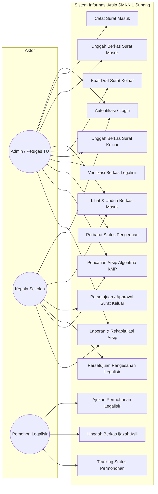
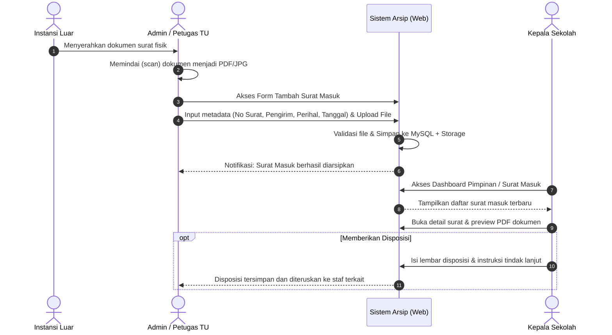
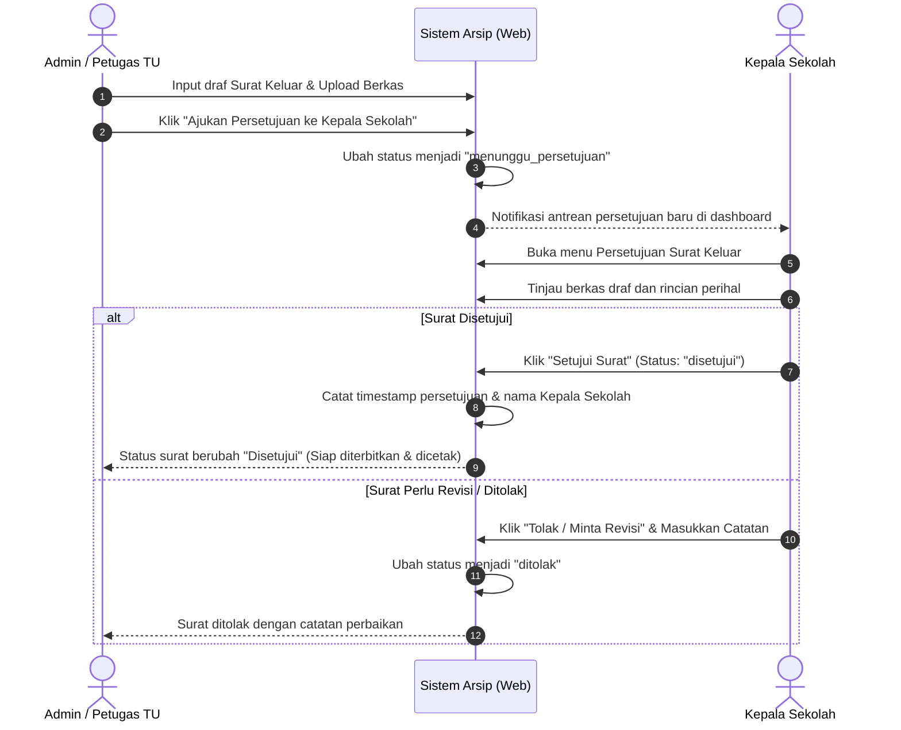
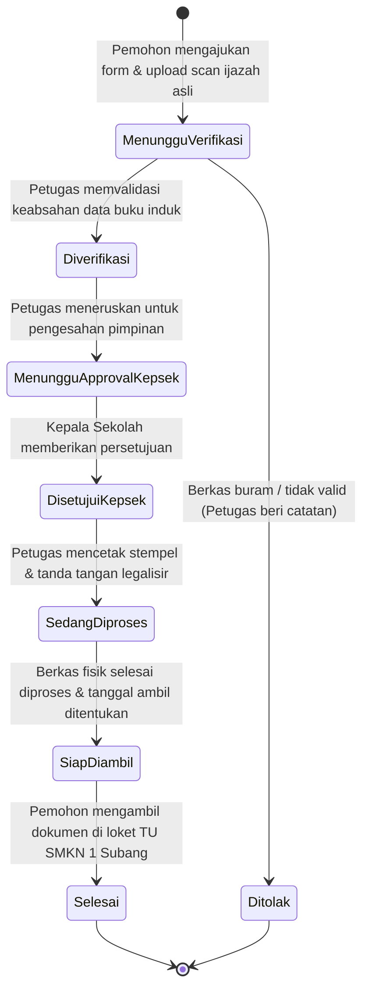
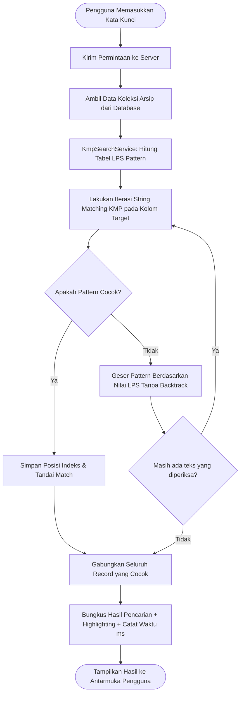

# 04. DESAIN WORKFLOW DAN PEMODELAN UML
**Sistem Informasi Pengelolaan Arsip SMKN 1 Subang**  
*Pemodelan Sistem Menggunakan Unified Modeling Language (UML) & Standar RUP*

---

## 1. Use Case Diagram

Diagram Use Case menggambarkan interaksi antara ketiga aktor sistem dengan fungsionalitas utama yang disediakan aplikasi:

---

## 2. Activity Diagram Alur Utama Sistem

### 2.1. Activity Diagram: Pengelolaan dan Disposisi Surat Masuk
Alur pencatatan surat masuk oleh Petugas hingga dapat ditinjau oleh Kepala Sekolah:

---

### 2.2. Activity Diagram: Pengajuan dan Persetujuan Surat Keluar
Alur pembuatan konsep surat keluar oleh Petugas hingga disetujui Kepala Sekolah:

---

### 2.3. Activity Diagram: Alur Layanan Legalisir Online Pemohon
Alur end-to-end layanan legalisir ijazah/transkrip dari pengajuan hingga pengambilan:

---

### 2.4. Activity Diagram: Pencarian Arsip Berbasis Algoritma KMP
Alur pencocokan teks menggunakan algoritma Knuth-Morris-Pratt:

---

## 3. Perancangan Halaman Antarmuka (UI/UX Blueprint)

1. **Dashboard Utama (Petugas & Kepsek):**
   - KPI Cards: Total Surat Masuk (Bulan ini), Total Surat Keluar, Antrean Persetujuan Kepsek, Permohonan Legalisir Aktif.
   - Quick Search Bar KMP di bagian atas header untuk pencarian instan dari mana saja.
   - Tabel 5 aktivitas dokumen terkini dengan badge status warna Tailwind.
2. **Halaman Data Surat Masuk / Keluar:**
   - Filter berdasarkan rentang tanggal dan klasifikasi kategori.
   - Tombol "Tambah Surat", "Ekspor Excel/PDF", "Cetak Agenda".
   - Fitur Modal Quick View PDF yang menyematkan PDF viewer langsung di browser tanpa harus mengunduh file terlebih dahulu.
3. **Halaman Khusus Approval Kepala Sekolah:**
   - Panel antrean persetujuan dokumen berformat *split view*: sebelah kiri ringkasan data, sebelah kanan preview berkas draf surat/legalisir.
   - Tombol aksi jelas: Hijau (*Setujui*) dan Merah (*Tolak dengan Catatan*).
4. **Portal Pelacakan Legalisir (Public Tracking):**
   - Halaman bersih dan responsif tanpa mewajibkan login rumit bagi alumni.
   - Input nomor resi pengajuan (cth: `LEG-2026-0001`) langsung menampilkan stepper status visual (Proses Verifikasi $\rightarrow$ Persetujuan $\rightarrow$ Siap Diambil).
